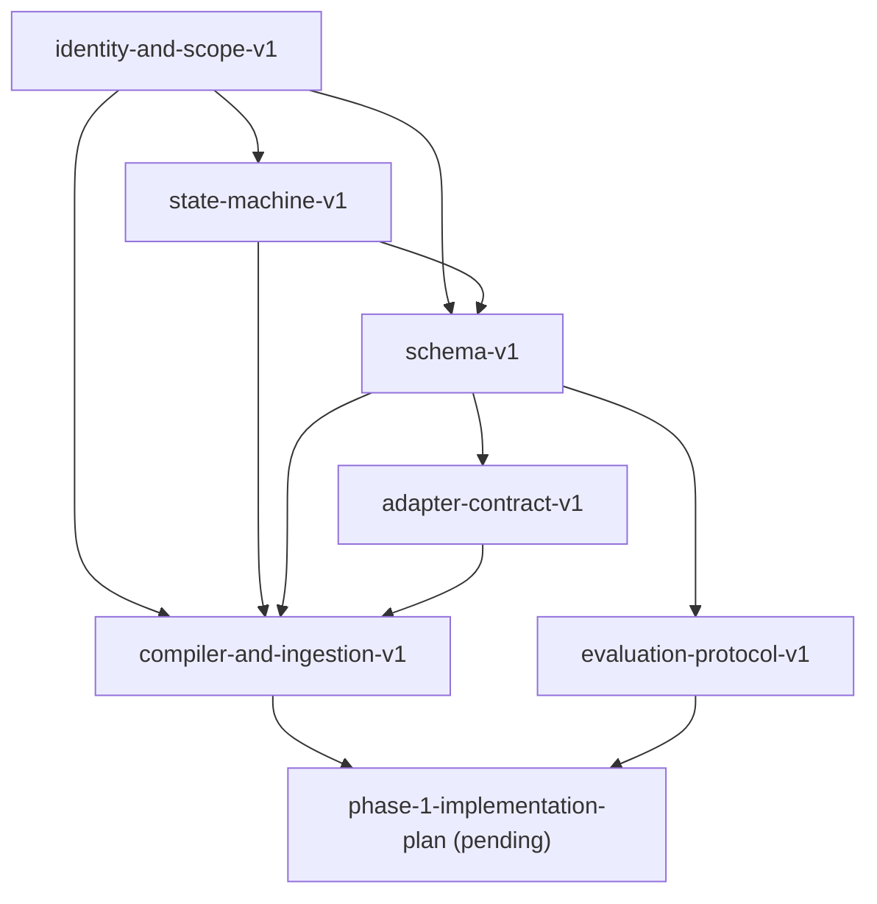

# Contract Index

**日期：** 2026-03-12  
**状态：** Index  
**作用：** 提供 contract 文档的依赖总览与阅读顺序

---

## 1. 阅读顺序

1. [identity-and-scope-v1.md](/Users/slicenfer/Development/projects/self/universal-memory-mcp/docs/planning/identity-and-scope-v1.md)
2. [state-machine-v1.md](/Users/slicenfer/Development/projects/self/universal-memory-mcp/docs/planning/state-machine-v1.md)
3. [schema-v1.md](/Users/slicenfer/Development/projects/self/universal-memory-mcp/docs/planning/schema-v1.md)
4. [adapter-contract-v1.md](/Users/slicenfer/Development/projects/self/universal-memory-mcp/docs/planning/adapter-contract-v1.md)
5. [evaluation-protocol-v1.md](/Users/slicenfer/Development/projects/self/universal-memory-mcp/docs/planning/evaluation-protocol-v1.md)
6. [compiler-and-ingestion-v1.md](/Users/slicenfer/Development/projects/self/universal-memory-mcp/docs/planning/compiler-and-ingestion-v1.md)

---

## 2. 依赖图

---

## 3. 每份文档负责什么

- `identity-and-scope-v1`
  - project identity
  - workspace boundary
  - scope semantics
  - `canonical_key`

- `state-machine-v1`
  - claim lifecycle
  - thread dual state
  - stale / supersede / archive rules

- `schema-v1`
  - core objects
  - required / optional fields
  - defaults
  - activation / outcome formulas

- `adapter-contract-v1`
  - runtime vs adapter responsibilities
  - capture / recall / tool boundaries

- `evaluation-protocol-v1`
  - benchmark
  - baseline
  - pass criteria

- `compiler-and-ingestion-v1`
  - event ingestion
  - deterministic extraction
  - canonical key ownership
  - stale sweep
  - logging boundaries

---

## 4. 冻结顺序

推荐冻结顺序：

1. identity
2. state machine
3. schema
4. compiler / ingestion
5. adapter contract
6. evaluation

---

## 5. 下一步

在这套 contract 冻结后，下一份应产出：

- `phase-1-implementation-plan.md`

它将基于本索引中的 contract 文档来拆任务、建表、定义 runtime 骨架与 reference adapter 实现顺序。
