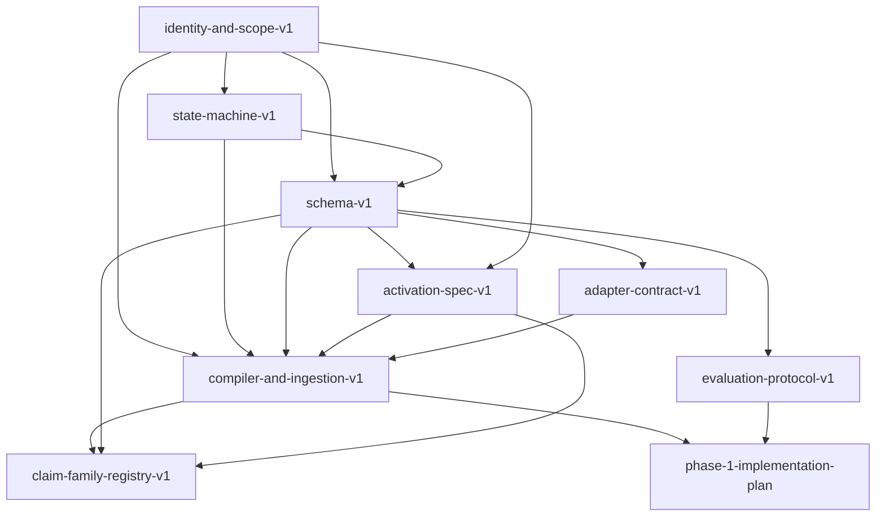

# Contract Index

**日期：** 2026-03-12  
**状态：** Index  
**作用：** 提供 contract 文档的依赖总览与阅读顺序

---

## 1. 阅读顺序

1. [identity-and-scope-v1.md](./identity-and-scope-v1.md)
2. [state-machine-v1.md](./state-machine-v1.md)
3. [schema-v1.md](./schema-v1.md)
4. [activation-spec-v1.md](./activation-spec-v1.md)
5. [claim-family-registry-v1.md](./claim-family-registry-v1.md)
6. [adapter-contract-v1.md](./adapter-contract-v1.md)
7. [evaluation-protocol-v1.md](./evaluation-protocol-v1.md)
8. [compiler-and-ingestion-v1.md](./compiler-and-ingestion-v1.md)

---

## 2. 依赖图

---

## 3. 每份文档负责什么

- `identity-and-scope-v1`
  - project identity
  - workspace boundary
  - scope semantics
  - `canonical_key`

- `state-machine-v1`
  - claim lifecycle
  - thread dual state
  - stale / supersede / archive rules

- `schema-v1`
  - core objects
  - required / optional fields
  - defaults
  - activation / outcome formulas

- `adapter-contract-v1`
  - runtime vs adapter responsibilities
  - capture / recall / tool boundaries

- `activation-spec-v1`
  - candidate generation
  - eligibility filter
  - ranking
  - packing

- `claim-family-registry-v1`
  - family inventory
  - key patterns
  - deterministic extractor entrypoints
  - lifecycle defaults

- `evaluation-protocol-v1`
  - benchmark
  - baseline
  - pass criteria

- `compiler-and-ingestion-v1`
  - event ingestion
  - deterministic extraction
  - canonical key ownership
  - stale sweep
  - logging boundaries

- `phase-1-implementation-plan`
  - milestone order
  - deliverables
  - implementation sequencing

---

## 4. 冻结顺序

推荐冻结顺序：

1. identity
2. state machine
3. schema
4. activation
5. compiler / ingestion
6. adapter contract
7. evaluation

---

## 5. 实施入口

在 contract 套件基础上，当前实施入口是：

- [phase-1-implementation-plan.md](./phase-1-implementation-plan.md)

它负责把 contract 文档转成里程碑、实现顺序和验收标准。
