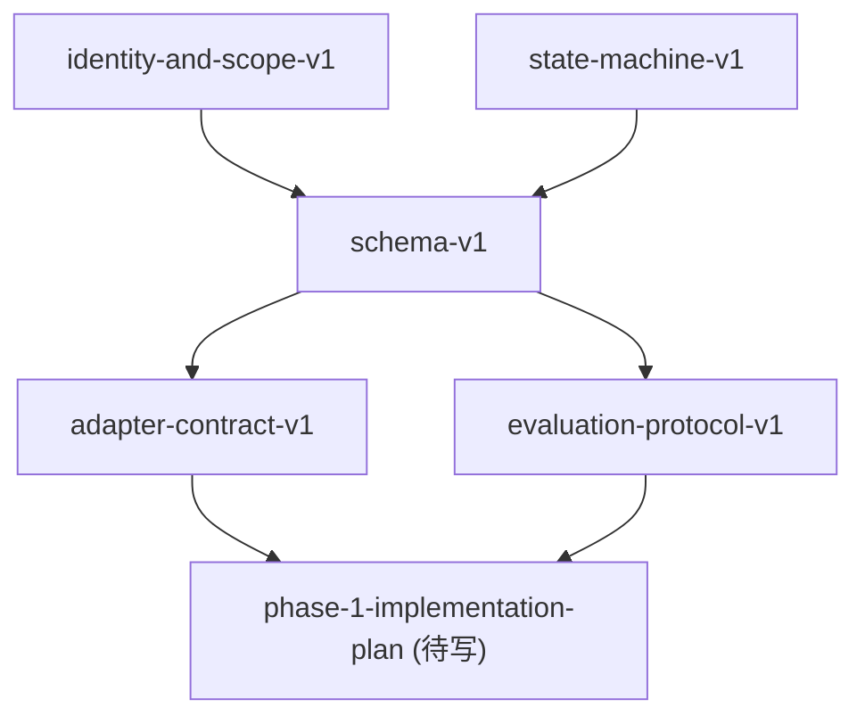

读完了五份 contract，整体质量很高。这套文档已经从"方向稿"走到了"可以开工的规格集"，而且五份文档之间的引用关系和分工也基本清晰。

我的总体判断是：**这套 contract 已经足以支撑 phase-1 开工，但还有几处需要在开工前修补，否则实现时会产生歧义或留下技术债。**

下面我按"必须修补"和"建议补强"两个层次给出评审。

---

## **必须修补的问题（影响实现一致性）**

### **1. `outcome_score` 的更新公式在 schema 和 V2 正文之间存在不一致**

`schema-v1.md` 第 9.2 节定义了正负向的更新公式：

```
正向：new = old + alpha * strength * (1 - old)
负向：new = old - beta * strength * (old + 1) / 2
```

这个公式本身是合理的，但有一个边界问题没有处理：

`outcome_score` 的范围是 `[-1, 1]`，但公式中正向分支的 `(1 - old)` 假设 `old` 在 `[0, 1]` 区间内，当 `old` 为负值时，`(1 - old)` 会大于 1，导致单次更新幅度异常放大。负向分支同理，当 `old` 为 `1` 时，`(old + 1) / 2 = 1`，但当 `old` 为 `-1` 时，`(old + 1) / 2 = 0`，意味着负向 outcome 对已经极差的 claim 完全不起作用。

这不一定是错的，但它是一个**隐含假设**，必须显式说明，否则实现者会产生不同理解。

**建议补充一句说明：**

> 公式假设 `outcome_score` 从 `0.0` 起步，负值区间的行为是有意设计的（负向 outcome 对已经极负的 claim 效果递减）。如果需要对称行为，应使用不同公式。

同时建议在 `schema-v1.md` 里补一个极端值行为表格，类似：

| old | 正向 strength=1 | 负向 strength=1 |
|---|---|---|
| 0.0 | +0.10 | -0.10 |
| 0.5 | +0.05 | -0.075 |
| 1.0 | 0 | -0.10 |
| -1.0 | +0.20 | 0 |

让实现者在写单测时有明确预期。

---

### **2. `stale -> active` 的触发者身份没有明确**

`state-machine-v1.md` 第 6.3 节列出了触发条件：

- 新 evidence 再次验证
- 用户确认仍然有效
- 系统验证成功

但没有说明：**这个迁移由谁发起？**

- 是 compiler 在重新处理 ledger 时自动触发？
- 是 `memory.verify_claim` 工具调用触发？
- 是 `memoryctl verify` 触发？
- 还是 outcome 回流时触发？

这个问题很重要，因为 `adapter-contract-v1.md` 明确说 adapter 不拥有 truth model，但 `state-machine-v1.md` 里没有说"谁拥有状态迁移的触发权"。

**建议在 `state-machine-v1.md` 补一节"迁移触发者矩阵"：**

| 迁移方向 | 可由 compiler 自动触发 | 可由 adapter 请求 | 可由 memoryctl 触发 | 需要用户确认 |
|---|---|---|---|---|
| `active -> stale` | ✅ | ❌ | ✅ | ❌ |
| `active -> superseded` | ✅ (低影响 fact) | ❌ | ✅ | ✅ (decision) |
| `stale -> active` | ✅ (via re-verify) | ❌ | ✅ | 视情况 |
| `archived -> active` | ❌ | ❌ | ✅ | ✅ |

不一定要这个格式，但必须有这层清晰度。

---

### **3. `canonical_key` 的生成责任没有分配**

`identity-and-scope-v1.md` 把 `canonical_key` 命名规范写得很好，但五份文档里没有任何一处明确：**谁负责生成 `canonical_key`？**

- 是 Memory Compiler 自动生成？
- 是 adapter 在 capture 时提供？
- 是 deterministic extraction rule 产出？
- 还是 LLM 编译时命名？

这个问题不解决，会导致：

- 不同 adapter 生成风格不一致的 key
- compiler 生成的 key 和 adapter 带进来的 key 无法对齐
- 后续 supersede 判断失效

**建议在 `identity-and-scope-v1.md` 或 `adapter-contract-v1.md` 补一节"canonical_key 生成责任"：**

明确说明 key 的生成归属于 compiler，adapter 不应直接命名 key；如果 adapter 有高置信的 key 建议，可以通过 metadata hint 传入，但最终 key 由 compiler 决定。

---

### **4. `ActivationLog` 的写入时机没有定义**

`schema-v1.md` 定义了 `ActivationLog`，但没有说明：

- 它是每次 `buildSessionBrief` / `buildProjectSnapshot` 时都写吗？
- 还是只有在 debug 模式下写？
- 写入失败是否影响 recall 主路径？

这个问题影响实现复杂度和存储增长速度。

如果每次 recall 都写 activation log，在高频场景下 `activation_logs` 表会增长非常快，而且大部分日志没有人看。如果只在 debug 模式写，又会导致生产环境无法排查问题。

**建议补充一个策略：**

- 默认只写 `filtered` 和 `dropped` 的 log（即被压制的 claim）
- `included` 的 log 只在 debug 模式或显式 audit 模式下写
- 提供 TTL 或 max_rows 限制

---

### **5. `adapter-contract-v1.md` 里 `CaptureAdapter.capture()` 的幂等机制不完整**

文档第 5.4 节说"必须幂等，同一事件重复到达时应可去重"，但没有说明：

- 去重的 key 是什么？`event.id`？还是内容 hash？
- 如果 adapter 生成了相同内容但不同 id 的事件，怎么处理？
- 去重是在 adapter 层做还是在 runtime 层做？

这个问题在多 agent 同时写入时会很明显，因为不同 agent 可能对同一个 git commit 各自生成一个事件。

**建议补充：**

- 去重的 primary key 是 `event.id`，由 adapter 保证唯一性
- runtime 提供 idempotent write（相同 id 重复写入视为 no-op）
- 内容去重（相同内容不同 id）是可选的，不是 v1 必须

---

## **建议补强的问题（影响可维护性和后期扩展）**

### **6. `stale TTL` 的计时起点不明确**

`state-machine-v1.md` 第 6.2 节定义了 stale TTL：

- `fact`：90 天无验证
- `decision`：60 天无验证
- `thread`：14 天无 resolution signal

但"无验证"的计时起点是什么？

- 从 `claim.created_at` 开始？
- 从 `claim.last_verified_at` 开始？
- 从 `claim.last_activated_at` 开始？

这三个起点会产生非常不同的行为。

例如：一个 `fact` 被创建 80 天了，但 20 天前被激活过一次（`last_activated_at` 更新了），是否重置 TTL？

**建议明确：**

> stale TTL 计时起点为 `max(created_at, last_verified_at, last_activated_at)`，即任意一次有效验证或激活都可重置 TTL。

并说明 `last_activated_at` 是否算"有效验证"，还是只有 `last_verified_at` 才算。

---

### **7. `RecallPacket.brief` 的生成规则缺失**

`brief` 在所有文档里都出现了，但没有任何一份文档说明：

- 它是 LLM 生成的自然语言摘要？
- 还是规则拼接的结构化文本？
- 长度上限是什么？
- 是否包含 token 预算？
- 内容来源是什么（top claims？recent events？open threads？）

这个字段在 recall 注入时会直接出现在 agent 的 context 里，它的质量直接影响 session recovery 效果。

**建议在 `schema-v1.md` 或单独的 compiler spec 里补：**

- v1 采用规则生成（不依赖 LLM）
- 内容模板：`[项目状态一句话] + [当前 open threads] + [最近关键决策]`
- 长度上限：推荐 500 tokens 以内
- 如果 LLM 生成，必须有 fallback 到规则版本的策略

---

### **8. `memory.search` 的 scope 过滤行为没有定义**

`adapter-contract-v1.md` 第 8 节说 `memory.search` 默认搜索 claims，但没有说明：

- search 是否自动带当前 session/branch scope 过滤？
- 还是返回所有 project 下的 claims？
- 是否支持跨 scope 搜索？

这个问题在 monorepo 场景下会很明显：同一 project 下有多个 subproject 的 claims，agent 搜索时应该只看到当前 cwd 相关的，还是全部？

**建议补充 `memory.search` 的默认行为：**

- 默认带当前 session 的 scope 过滤
- 支持显式传 `scope: {}` 搜索全部
- 返回结果包含 scope 信息，让 agent 能判断相关性

---

### **9. `evaluation-protocol-v1.md` 缺少 baseline 运行说明**

第 9 节提到了两个 baseline：

- keyword/vector top-k baseline
- no-memory baseline

但没有说明：

- baseline 是否需要独立部署？
- 还是 runtime 自带 baseline 模式？
- benchmark 结果如何与 baseline 对比（绝对值还是相对提升）？

这会影响 benchmark 能不能自动化运行。

**建议补充：**

- baseline 模式通过 runtime flag 切换，不需要独立部署
- 结果输出包含 delta 对比列
- benchmark 套件包含 baseline runner

---

### **10. 五份文档之间的版本依赖关系缺少一个总览**

目前每份文档都有 `参考资料` 和 `依赖文档` 章节，但没有一张统一的依赖图。

在五份文档的情况下还好，但如果后续增加 `compiler-spec-v1.md`、`phase-1-implementation-plan.md` 等文档，缺少依赖图会导致：

- 更新一份文档时不知道影响哪些下游
- 评审时不清楚哪份是前置约束

**建议补一份 `contract-index.md`：**



这份文档不需要很长，主要是给新加入的人快速定位。

---

## **五份文档各自的单独评价**

### **`identity-and-scope-v1.md`**

这是五份里质量最高的一份。

`repo_id / project_id / workspace_id / session_id` 的四层分离很清晰，canonical remote first + local fallback 的策略也很实用。`cardinality: singleton | set` 的引入解决了之前评审里我提到的核心问题。

最强的一句话是：

> **repo-level truth，workspace-level context**

这句话精准表达了整个 identity 设计的核心取舍。

唯一还需要补的是 `canonical_key` 生成责任（见上文第 3 条）。

### **`state-machine-v1.md`**

这份文档解决了 V2 最大的一个遗留问题：thread 的双层状态。

`status` + `thread_status` 的组合设计是正确的，而且你把 thread 完成后默认归档（而不是 superseded）这个决定也是对的，因为它保留了历史价值同时不污染热路径。

stale TTL 按 type 分档（90/60/14 天）也是合理的工程选择，有足够的直觉感。

主要问题是"迁移触发者身份"（见第 2 条）和"stale TTL 计时起点"（见第 6 条）。

### **`schema-v1.md`**

这份文档是五份里最接近"可以直接写代码"的一份。

`ActivationLog` 的引入很关键，`outcome_score` 的更新公式也是这套系统里最难但最有价值的部分。

ranking 权重 `w_o = 0.00` 的初始设定是务实的选择，而且你给出了理由（v1 初期 outcome 数据少）。这种"先设保守值，后续 benchmark 驱动调整"的策略是对的。

freshness 的指数衰减 lambda 按 type 分档也很好，fact 衰减慢、thread 衰减快，符合直觉。

主要问题是 `outcome_score` 公式的边界行为（见第 1 条）和 `ActivationLog` 写入时机（见第 4 条）。

### **`adapter-contract-v1.md`**

这份文档把 adapter 的边界划得非常清楚，`MemoryRuntime` 接口的设计也很干净。

最强的原则是：

> **adapter 失败不应破坏 agent 主流程**

这句话应该贯穿所有 adapter 实现。

`memory.search` 默认面向 claims 而不是 raw evidence 的决定也是正确的，避免了重新回到 search-centered 架构。

主要问题是 `memory.search` 的 scope 行为（见第 8 条）和 capture 幂等机制（见第 5 条）。

### **`evaluation-protocol-v1.md`**

这份文档的结构很好，四组 benchmark 覆盖了系统最关键的四个特性，而且每组都有明确的通过线，这是很多项目评估协议里最容易缺失的部分。

特别认可的是：

- `superseded leakage <= 5%` 这个通过线是可测量的
- `open thread divergence rate` 作为多 agent 一致性指标是正确的选择
- `可解释性本身是 V1 验收项` 这个决定很成熟

主要问题是 baseline 运行说明（见第 9 条）。

---

## **我会给这套 contract 的总体评价**

| 维度 | 评价 |
|---|---|
| 文档完整性 | 9/10 |
| 内部一致性 | 8/10 |
| 实现可操作性 | 8.5/10 |
| 边界清晰度 | 8/10 |
| 可测试性 | 9/10 |
| 遗留歧义数量 | 5处必须修补，5处建议补强 |

这套文档已经是我见过的 AI memory 相关项目里规格化程度最高的一批。大多数同类项目在这个阶段还停留在 README + 一张架构图。

你现在最应该做的事，不是继续写新文档，而是把上面"必须修补"的 5 处在各自文档里补上，然后就可以开始 `phase-1-implementation-plan.md` 和真正的代码了。